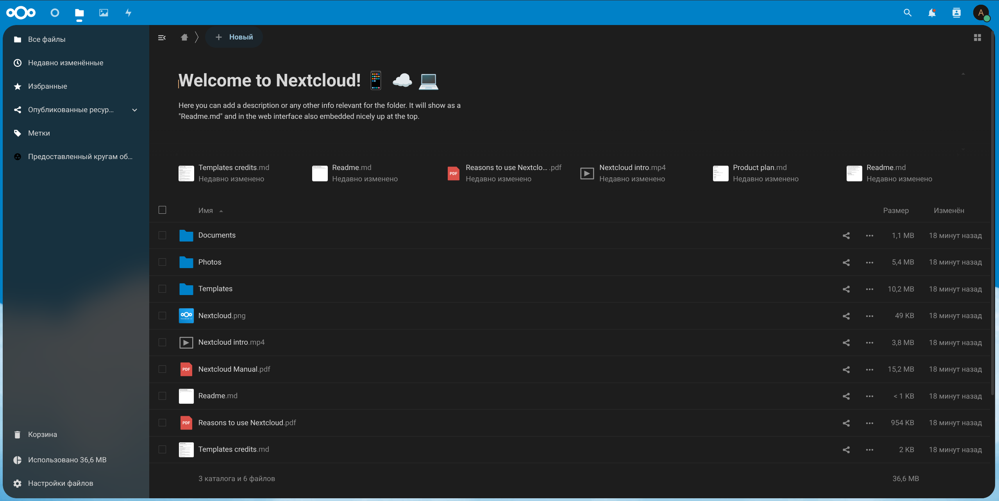
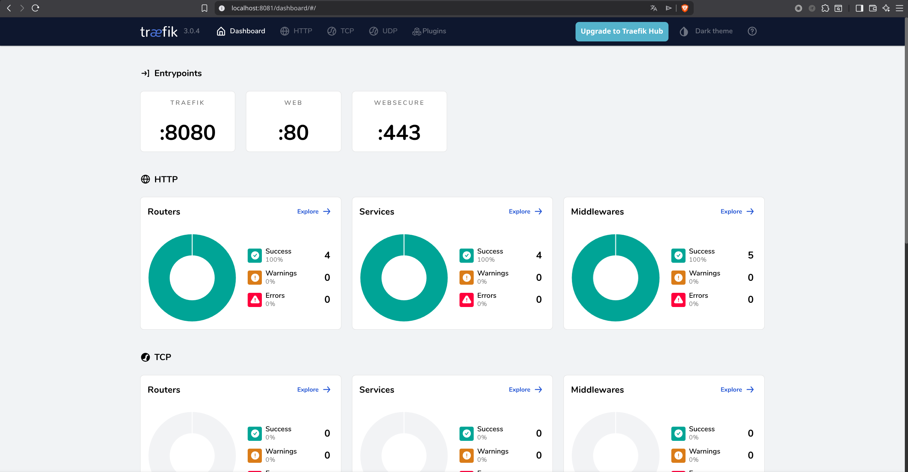

# ☁️ Nextcloud Stack: The No-Nonsense Self-Hosting Guide

Setting up a personal cloud shouldn't be a weekend-long ordeal of debugging PHP extensions and fighting with SSL configs. I built this stack to automate the boring parts so you can get straight to the "cloud" part. It’s optimized for **Podman** (rootless) and **Docker**, focusing on high security and modern network performance.


*The end result: A fast, secure, and modern Nextcloud instance running in a dark theme.*

---

## Why this stack?

I've seen too many "simple" setups that cut corners on security or performance. This project is my attempt to do it right. Here’s what makes it different:

*   **Speed without the overhead:** We use **Redis** for session handling and file locking, which makes the interface feel snappy even on modest hardware.
*   **Security by default:** No old TLS versions here. I've locked it down to **TLS 1.3** and enabled **HSTS** (Strict Transport Security) right out of the box. 
*   **Modern Web Ready:** It fully supports **HTTP/3 (QUIC)** and **HTTP/2**. If your browser supports it, your cloud will use the fastest available protocol.
*   **Privacy-First:** Designed for **Rootless Podman**. This means even if a container is compromised, the attacker still doesn't have root access to your host system.
*   **Zero-Effort Proxy:** Traefik v3 handles all the routing and automatically grabs SSL certificates from Let's Encrypt for you.

---

## Technical Architecture

I’ve integrated four core services that work together as a single unit:

1.  **Traefik v3:** Acts as the gateway. It listens for incoming traffic and routes it to the right place while providing a layer of security.
2.  **Nextcloud:** The application layer (Apache/PHP). Optimized to handle heavy file uploads and multi-user sync.
3.  **PostgreSQL 16:** A solid, production-grade database to store all your file metadata and user settings.
4.  **Redis 7:** The lightning-fast memory cache that keeps everything running smoothly.


*Behind the scenes: The Traefik dashboard confirms our routes are healthy and the secure entrypoints are active.*

---

## 🚀 Getting Started

You can have this running on your local machine for testing in about 3 minutes.

### 1. Prerequisites
Make sure you have either `docker` or `podman` installed. On Linux, Podman is highly recommended for its security benefits.

### 2. Deployment
```bash
# Clone the repo
git clone https://github.com/suraiya8239/nextcloud-docker-stack.git
cd nextcloud-docker-stack

# Run the automated setup
bash setup.sh --dev
```

### 3. Access
*   **HTTPS (Secure):** [https://localhost:8443](https://localhost:8443)
*   **HTTP (Local):** [http://localhost:8080](http://localhost:8080)
*   **Login:** `admin`
*   **Password:** *Check your auto-generated `.env` file for the password.*

*Note: Since it's a local setup, the SSL certificate is self-signed. Your browser will complain—just click "Advanced" and proceed. It’s safe.*

---

## 🌍 Moving to Production

When you're ready to put this on a real server with a domain:

```bash
bash setup.sh --domain yourcloud.com --email you@email.com
```

The script will reconfigure Traefik to use real Let's Encrypt certificates. Ensure ports 80 and 443 are open on your firewall.

---

## 🛠 Maintenance

I’ve included a few helper scripts in the `scripts/` folder to make your life easier:
*   `health-check.sh`: Checks if all containers are healthy and responding.
*   `backup.sh`: Dumps the database and configs into the `backups/` folder.
*   `update.sh`: Pulls the newest images and restarts the stack without losing data.

---

## License
MIT. Use it, break it, fix it, share it.
